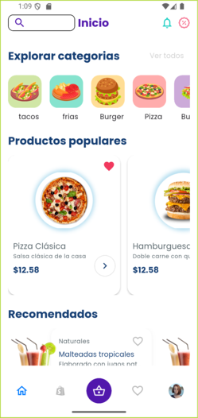
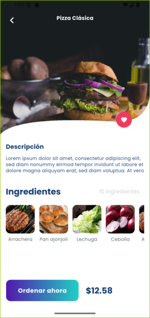
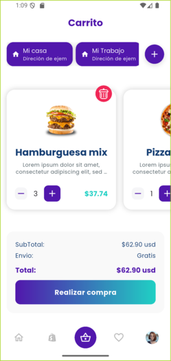
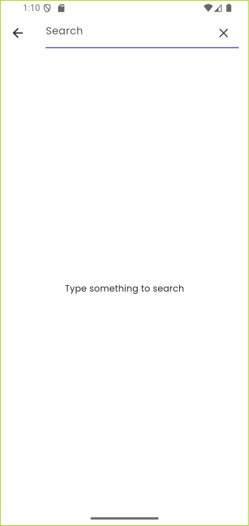
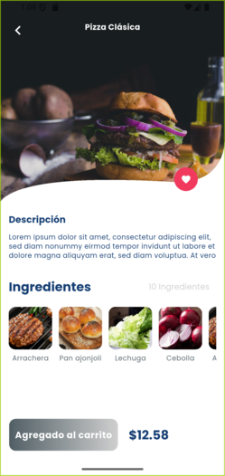

#  Food Delivery App

## Description

This is a food delivery mobile application built with Flutter. The app allows users to browse different food categories, view product details, add items to their cart, and proceed to checkout. It features a modern and clean user interface, and it is built using the Cubit state management library.

**Technologies, Frameworks, and Packages:**

*   **Flutter:** The UI toolkit for building natively compiled applications for mobile, web, and desktop from a single codebase.
*   **Dart:** The programming language used for Flutter development.
*   **Cubit:** A lightweight state management solution that is a subset of the BLoC pattern.
*   **go_router:** A declarative routing package for Flutter that simplifies navigation (inferred from `lib/utils/router`).

## Features

*   **Home Page:** Displays a welcome message, food categories, and popular food items.
*   **Product Details:** Shows detailed information about a selected food item, including ingredients and price. Users can add items to their cart from this page.
*   **Shopping Cart:** Allows users to view the items they have added to their cart, adjust the quantity, and see the total price.
*   **Search:** Users can search for specific food items.
*   **Favorites:** Users can mark items as favorites and view them on a dedicated favorites page.
*   **User Profile:** A section for user-related information and settings.
*   **Shop Page:** A page that likely displays all available products.

## Project Structure

```
c:\rich_Sonic\delivery_app\
├───lib
│   ├───main.dart         # App entry point
│   ├───root.dart           # Root widget, likely handles navigation
│   ├───models            # Data models (Product, Category, etc.)
│   ├───utils             # Utilities (routing, theme, constants)
│   ├───view_models       # Cubits for state management
│   └───views             # UI (pages and widgets)
├───assets
│   ├───fonts             # Custom fonts
│   └───images            # App images and icons
├───android             # Android specific files
├───ios                 # iOS specific files
├───web                 # Web specific files
├───windows             # Windows specific files
├───linux               # Linux specific files
├───macos               # macOS specific files
└───test                # Test files
```

**Folder Explanations:**

*   **`lib`**: Contains the core Dart code for the application.
    *   **`models`**: Defines the data structures for the app (e.g., `Product`, `Category`).
    *   **`utils`**: Includes helper classes and utilities, such as the app router, theme data, and constants.
    *   **`view_models`**: Contains the business logic and state management using Cubits.
    *   **`views`**: Contains the UI of the application, separated into `pages` (screens) and `widgets` (reusable UI components).
*   **`assets`**: Contains static assets like images and fonts.
*   **Platform-specific folders (`android`, `ios`, etc.)**: Contain the project configurations and code for each specific platform.

## Installation & Setup

1.  **Clone the repository:**
    ```bash
    git clone https://github.com/your-username/rich_sonic_delivery_app.git
    cd rich_sonic_delivery_app
    ```

2.  **Get dependencies:**
    ```bash
    flutter pub get
    ```

3.  **Run the app:**
    ```bash
    flutter run
    ```

## Screenshots

| Home Page                                         | Product Details                                       | Cart                                        | Search                                    | Add to Cart                                     |
| ------------------------------------------------- | ----------------------------------------------------- | ------------------------------------------- | ----------------------------------------- | ----------------------------------------------- |
|  |  |  |  |  |
| _Caption: The main screen of the application._      | _Caption: Detailed view of a product._                  | _Caption: The user's shopping cart._          | _Caption: The search page._                 | _Caption: Adding an item to the cart._           |

## Usage

A typical user flow would be:
1.  Open the app and land on the Home Page.
2.  Browse through the food categories or popular items.
3.  Tap on an item to view its details.
4.  Add the item to the cart.
5.  Navigate to the cart to review the order.
6.  Proceed to checkout.

## Contributing

Contributions are welcome! If you have any suggestions, bug reports, or want to contribute to the code, please feel free to open an issue or a pull request.

1.  Fork the Project.
2.  Create your Feature Branch (`git checkout -b feature/AmazingFeature`).
3.  Commit your Changes (`git commit -m 'Add some AmazingFeature'`).
4.  Push to the Branch (`git push origin feature/AmazingFeature`).
5.  Open a Pull Request.

## License

This project is licensed under the MIT License.